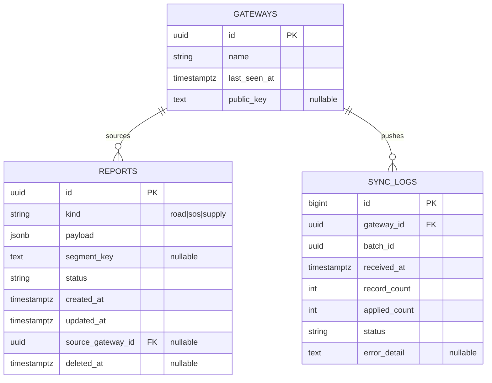

# Entity relationship (Zone A, Issue #1)

Mermaid source (renders on GitHub and many Markdown viewers).

**Constraints**

- `SYNC_LOGS (gateway_id, batch_id)` is **unique** (idempotent batch ingest).

**Indexes (summary)**

- `reports (kind, segment_key)`, `reports (updated_at)`, btree indexes on `kind`, `segment_key`, `source_gateway_id` as implemented in Alembic revision `20260412_0001`.
